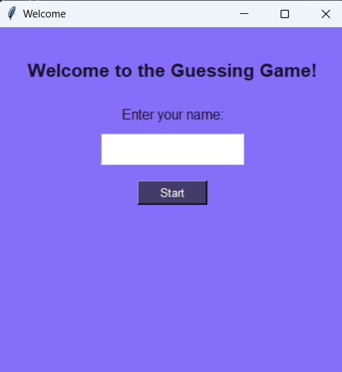
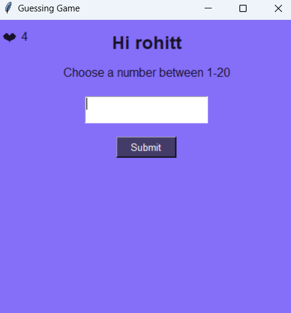

cat << 'EOF' > README.md
# 🎯 Python Number Guessing Game (Tkinter GUI)

A simple and fun number guessing game built using Python's Tkinter library.  
Challenge yourself by selecting different difficulty levels and guessing the correct number within limited chances!

---

## 📌 Project Overview

This is a GUI-based number guessing game where:
- The computer generates a random number.
- The player selects a difficulty level (Easy / Medium / Hard).
- The player tries to guess the number within a limited number of attempts (indicated by ❤️ hearts).
- The game gives hints like "Go Up" or "Go Down" based on guesses.

---

## 🎮 Features

- 🧠 **Three Difficulty Levels:**
  - Easy: Numbers between 1–20 (4 attempts)
  - Medium: Numbers between 1–50 (5 attempts)
  - Hard: Numbers between 1–100 (7 attempts)

- 💬 **Hint System:** Guides the user whether to go higher or lower.

- ❤️ **Life System:** Hearts represent number of attempts left.

- 🗂 **Result Logging:** Each game outcome (win/loss) is stored in a `log.txt` file.

- 🧑 **Player Name Input:** Personalized greeting and tracking.

---

## 🖥 Screenshots

| Welcome Page | Level Selection | Game Page |
|--------------|-----------------|------------|
|  |  |  |

---

## ⚙️ Requirements

- Python 3.x
- Tkinter (comes pre-installed with Python on most systems)

---
